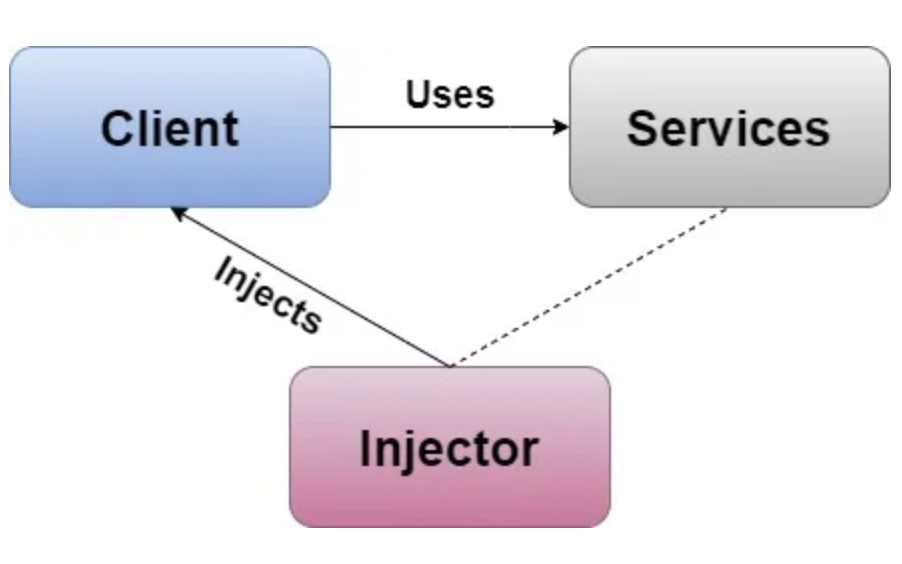

# **Dependency Injection**

It is a software design pattern in which an object receives another objects that it depends on. These objects are called dependencies. Receiving object is called `client` and the passed object is called `service`. The code that passes or inject the service to the client is call injector.

> Passing a dependency(service) into an object(client) using an injector.

## Index
* Dependency Injection(#Dependency-Injection)
    + [Initializer Injection](#Dependency-Injection)
    + [Setter Injection](#Setter-Injection)
    + [Interface Injection](#Interface-Injection)

To implement Dependency Inversion we use Inversion of Control(IoC) principle. In this we aim to construct all the responsibilities of the class to its dependencies. 
Dependency Inversion is of following types.

* Initializer Injection or Constructor Injection.
* Setter Injection (Property Injection or Method Injection).
* Interface Injection

## Initializer Injection

In this way we can pass all the dependencies in the client class using initializer parameters.

Example: [Initializer Injection or Constructor Injection](DependencyInjection.playground/Sources/InitializerInjection.swift)

## Setter Injection

In this way we can pass all the dependencies in the client class using property or a setter method.

Example: [Setter Injection](DependencyInjection.playground/Sources/SetterInjection.swift)

## Interface Injection

In this way the client confirms to the protocol used to inject the dependencies.

Example: [Interface Injection](DependencyInjection.playground/Sources/InterfaceInjection.swift)
